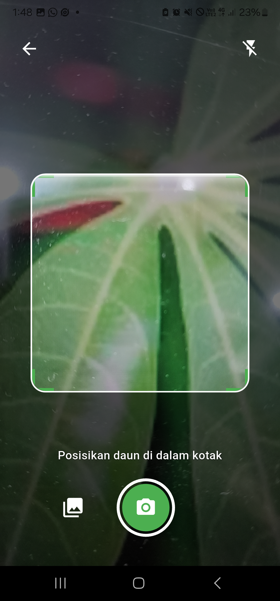
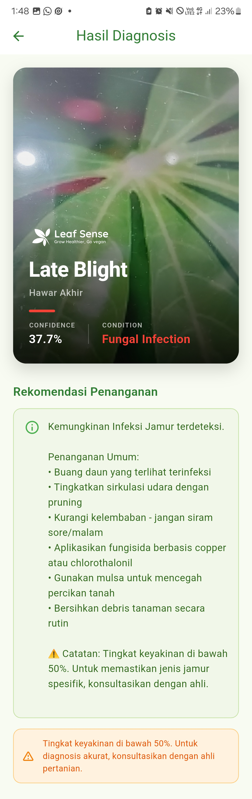
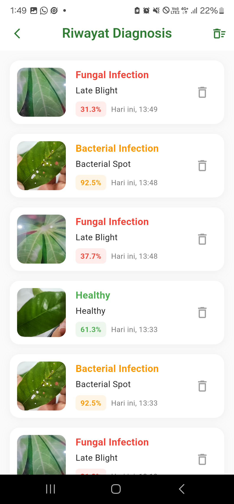

# 🌱 Leaf Sense - Plant Disease Detection App

<p align="center">
  
</p>

<p align="center">
  <strong>AI-Powered Plant Disease Detection for Peppers, Potatoes & Tomatoes</strong>
</p>

<p align="center">
  
  
  
  
</p>

---

## 📖 About

**Leaf Sense** is a mobile application that leverages Machine Learning to detect plant diseases in real-time. Using a TensorFlow Lite model trained on the PlantVillage dataset, the app can identify 15 different disease conditions across three plant types: peppers, potatoes, and tomatoes.

### ✨ Key Features

- 🎥 **Real-time Camera Scanning** - Instant disease detection through live camera feed
- 📸 **Gallery Upload** - Analyze existing photos from your device
- 🤖 **AI-Powered Detection** - 15-class disease classification with confidence scoring
- 💾 **Diagnosis History** - Local database to track and review past scans
- 📊 **Confidence-Based Recommendations** - Specific treatment for high confidence (≥50%), general advice for low confidence
- 📱 **Haptic Feedback** - Vibration alerts on successful scans
- ⚙️ **Customizable Settings** - Toggle haptic feedback and auto-save history
- 📚 **Scientific References** - Treatment recommendations based on peer-reviewed sources
- 🌐 **Multilingual** - English UI with Indonesian recommendations

---

## 🎯 Disease Categories

The app classifies plant conditions into **5 main categories**:

| Category | Color | Description |
|----------|-------|-------------|
| 🟢 **Healthy** | Green | Plant is in good condition |
| 🟠 **Bacterial Infection** | Orange | Bacterial spot and similar infections |
| 🔴 **Fungal Infection** | Red | Early blight, late blight, leaf mold, septoria, target spot |
| 🔴 **Viral Infection** | Dark Red | Yellow leaf curl virus, mosaic virus |
| 🟤 **Pest Damage** | Brown | Spider mites and pest-related damage |

---

## 🧬 Supported Diseases (15 Classes)

### Peppers
- Bacterial Spot
- Healthy

### Potatoes
- Early Blight
- Late Blight
- Healthy

### Tomatoes
- Bacterial Spot
- Early Blight
- Late Blight
- Leaf Mold
- Septoria Leaf Spot
- Spider Mites (Two-spotted)
- Target Spot
- Yellow Leaf Curl Virus
- Mosaic Virus
- Healthy

---

## 🛠️ Tech Stack

- **Framework**: Flutter 3.0+
- **Language**: Dart
- **ML Model**: TensorFlow Lite
- **Database**: SQLite (via sqflite)
- **Local Storage**: SharedPreferences
- **Image Processing**: image package
- **Camera**: camera plugin
- **Design**: Material Design 3

### 📦 Key Dependencies
```yaml
dependencies:
  # Core
  flutter:
    sdk: flutter
  
  # AI & ML
  tflite_flutter: ^0.10.3
  image: ^4.0.17
  
  # Camera & Media
  camera: ^0.10.5
  image_picker: ^1.0.4
  
  # UI & Assets
  flutter_svg: ^2.0.9
  
  # Storage & Database
  sqflite: ^2.3.0
  shared_preferences: ^2.2.2
  path_provider: ^2.1.1
  path: ^1.9.0
  
  # Features
  vibration: ^1.8.4
  share_plus: ^7.2.1
  url_launcher: ^6.2.2
  intl: ^0.19.0
```

---

## 🚀 Getting Started

### Prerequisites

- Flutter SDK 3.0 or higher
- Dart SDK 2.17 or higher
- Android Studio / VS Code with Flutter extensions
- Physical device or emulator

### Installation

1. **Clone the repository**
```bash
   git clone https://github.com/dikapradnyanta/leaf-sense.git
   cd leaf-sense
```

2. **Install dependencies**
```bash
   flutter pub get
```

3. **Add the TensorFlow Lite model**
   
   Place your `plant_disease_model.tflite` file in:
```
   assets/model/plant_disease_model.tflite
```

4. **Update `pubspec.yaml` assets**
```yaml
   flutter:
     assets:
       - assets/logo/
       - assets/model/plant_disease_model.tflite
```

5. **Run the app**
```bash
   flutter run
```

---

## 📂 Project Structure
```
lib/
├── camera/
│   ├── camera_page.dart        # Real-time camera scanning
│   ├── camera_service.dart     # Camera initialization
│   └── result_page.dart        # Diagnosis results display
├── classifier/
│   ├── classifier.dart         # TFLite model inference
│   └── rule.dart               # Disease mapping & recommendations
├── database/
│   ├── database_helper.dart    # SQLite CRUD operations
│   └── history_model.dart      # Diagnosis history model
├── pages/
│   ├── home_page.dart          # Main dashboard
│   ├── settings_page.dart      # App settings
│   ├── history_page.dart       # Diagnosis history list
│   └── disclaimer_page.dart    # AI disclaimer & references
├── services/
│   └── settings_service.dart   # SharedPreferences manager
└── main.dart                   # App entry point
```

---

## 🎨 Screenshots

<p align="center">
  
  
  
  
</p>

---

## 🧪 How It Works

### 1. **Image Preprocessing**
- Center crop to square aspect ratio
- Resize to model input size (224x224 or as specified)
- HSV color filtering to validate plant presence
- Normalize pixel values (0-255 range)

### 2. **Plant Detection Filter**
```dart
// Strict HSV-based plant color detection
bool _isPlantColor(img.Image image) {
  // Check center crop area (60%)
  // Validate: Hue (10-165°), Saturation (>15%), Value (>20%)
  // Reject: Non-plant objects (walls, furniture, etc.)
  return plantRatio > 0.30; // 30% threshold
}
```

### 3. **Disease Classification**
- TensorFlow Lite model inference
- 15-class softmax output
- Confidence scoring (0-100%)

### 4. **Recommendation System**
```dart
if (confidence >= 50%) {
  // Specific treatment recommendations
  // Based on disease type and plant
} else {
  // General category-based advice
  // With low confidence warning
}
```

---

## ⚙️ Configuration

### Settings (Stored in SharedPreferences)

| Setting | Default | Description |
|---------|---------|-------------|
| Haptic Feedback | ON | Vibration on successful scan |
| Save History | ON | Auto-save diagnosis to database |
| Dark Mode | OFF | Coming soon |
| High Quality | OFF | Coming soon |

### Model Configuration

Edit `classifier.dart` to adjust:
- Input image size
- Confidence threshold (default: 50%)
- Preprocessing parameters

---

## 📊 Model Performance

- **Dataset**: PlantVillage (15 classes subset)
- **Architecture**: MobileNetV2 / EfficientNet (specify your model)
- **Input Size**: 224x224 RGB
- **Accuracy**: ~XX% on test set (update with your metrics)
- **Inference Time**: ~XXms on mid-range devices

---

## 🔬 Scientific References

Treatment recommendations are based on research from:

- **University of Minnesota Extension** - Plant disease management
- **NC State Extension** - Tomato disease guides
- **University of Florida IFAS** - Viral disease control
- **MDPI Agriculture** - Sustainable disease management
- **West Virginia University** - Bacterial spot treatment

Full references available in the app's Disclaimer page.

---

## ⚠️ Disclaimer

- **AI Limitations**: This app is not 100% accurate. Results depend on photo quality, lighting, and leaf condition.
- **Not a Replacement**: Always consult with agricultural experts for professional diagnosis.
- **Treatment Caution**: Pesticide/fungicide recommendations are general. Check local regulations and product labels.
- **Scope**: Model trained specifically for peppers, potatoes, and tomatoes from PlantVillage dataset.

---

## 🗺️ Roadmap

- [ ] Expand to more plant species
- [ ] Multi-language support
- [ ] Cloud sync for history
- [ ] Export diagnosis reports (PDF/CSV)
- [ ] Dark mode theme
- [ ] Offline model updates
- [ ] Community features (share findings)
- [ ] Integration with agriculture APIs

---

## 🤝 Contributing

Contributions are welcome! Please follow these steps:

1. Fork the repository
2. Create a feature branch (`git checkout -b feature/AmazingFeature`)
3. Commit your changes (`git commit -m 'Add some AmazingFeature'`)
4. Push to the branch (`git push origin feature/AmazingFeature`)
5. Open a Pull Request

---

## 📄 License

This project is licensed under the MIT License - see the [LICENSE](LICENSE) file for details.

---

## 👨‍💻 Author

**Your Name**
- GitHub: [@dikapradnyanta](https://github.com/dikapradnyanta)
- Email: ikomangdikapradnyanta@gmail.com

---

## 🙏 Acknowledgments

- **PlantVillage Dataset** by Penn State University
- **TensorFlow Lite** team for mobile ML framework
- **Flutter Community** for excellent packages and support
- **Agricultural Extension Services** for scientific references

---

## 📞 Support

If you encounter any issues or have questions:

1. Check the [Issues](https://github.com/dikapradnyanta/leaf-sense/issues) page
2. Open a new issue with detailed description
3. Contact via email: ikomangdikapradnyanta@gmail.com

---

<p align="center">
  Made with ❤️ and 🌱 by [Dika Pradnyanta]
</p>

<p align="center">
  <strong>Help farmers protect their crops with AI!</strong>
</p>
